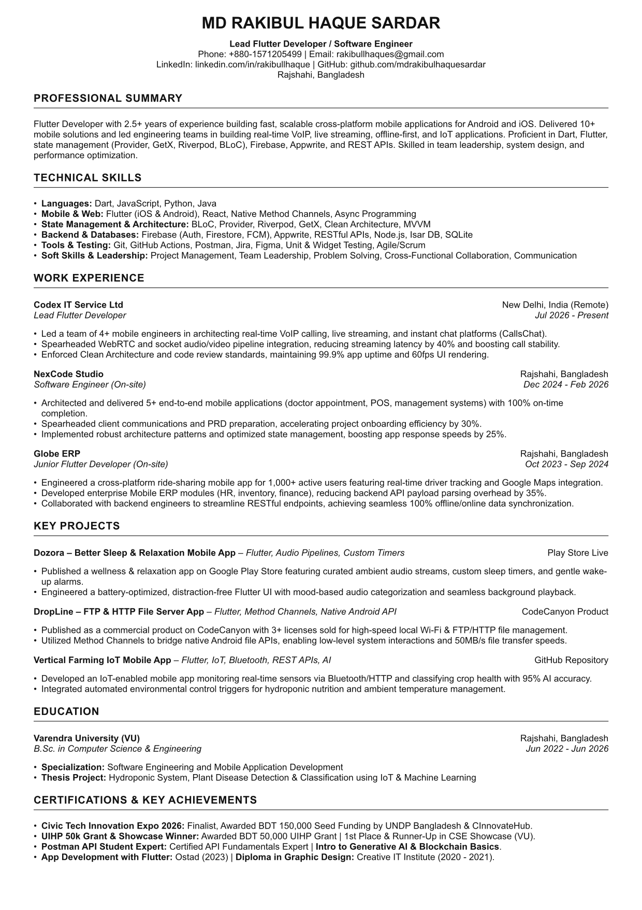

# 📄 MD Rakibul Haque Sardar — Lead Flutter Developer & Software Engineer

[](https://github.com/mdrakibulhaquesardar/rakibul-haque-flutter-developer-resume)
[](https://typst.app)
[](./resume.pdf)

> **100% ATS-Compliant, Single-Page Modern Software Engineer Resume** built using **Typst**.

---

## 🖼️ Resume Preview



---

## 📥 Downloads & Direct Links

- 📕 **Download PDF Resume:** [resume.pdf](./resume.pdf)
- 📄 **Source Typst Code:** [resume.typ](./resume.typ)
- 💼 **LinkedIn Profile:** [linkedin.com/in/rakibullhaque](https://www.linkedin.com/in/rakibullhaque)
- 🐙 **GitHub Profile:** [github.com/mdrakibulhaquesardar](https://github.com/mdrakibulhaquesardar)

---

## 🛠️ Summary & Technical Stack

- **Role:** Lead Flutter Developer / Software Engineer
- **Experience:** 2.5+ Years building scalable Android & iOS mobile applications
- **Primary Tech:** Flutter, Dart, BLoC, Provider, Riverpod, GetX, Clean Architecture, MVVM
- **Backend & DB:** Firebase, Appwrite, RESTful APIs, Node.js, Isar DB, SQLite
- **Specializations:** VoIP Calling, Live Streaming, Offline-First Architectures, Native Method Channels, IoT App Integration

---

## 🔨 How to Compile locally with Typst

```bash
# Compile to ATS-Friendly PDF
typst compile resume.typ resume.pdf
```
